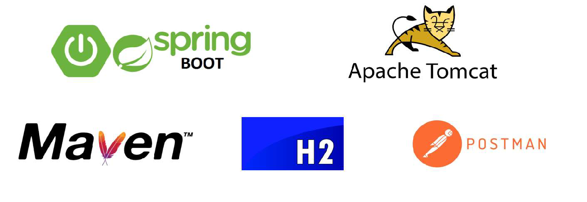

# Projeto web services com Spring Boot e JPA / Hibernate
## Objetivos:
 - Criar projeto Spring Boot Java
 - Implementar modelo de domínio
 - Estruturar camadas lógicas: resource, service, repository
 - Configurar banco de dados de teste (H2)
 - Povoar o banco de dados
 - CRUD - Create, Retrieve, Update, Delete
 - Tratamento de exceções
 # Ferramentas usadas
 
 - **Spring Boot**: é um framework que simplifica a criação de aplicativos Spring prontos para produção. Ele oferece configuração mínima, servidores embutidos e recursos prontos para uso em produção 
 - **Apache Tomcat**: é um software de código aberto que implementa as especificações do Jakarta EE para aplicativos web.
 - **Apache Maven**: é uma ferramenta de gerenciamento e compreensão de projetos de software para Java. Ele se baseia no conceito de um Modelo de Objeto de Projeto (POM) e pode gerenciar a compilação, relatórios e documentação de um projeto a partir de uma única fonte de informações
 - **H2**:  é um banco de dados relacional escrito em Java. Ele pode ser usado em modo integrado (dentro da mesma JVM) ou como um servidor remoto. O H2 suporta bancos de dados persistentes e em memória, sendo uma opção leve e rápida para aplicações Java.
 - **Postman**: é uma plataforma de API abrangente que simplifica cada etapa do ciclo de vida da API e agiliza a colaboração para melhores APIs. Com o cliente REST do Postman, você pode enviar solicitações, inspecionar respostas e depurar facilmente APIs REST